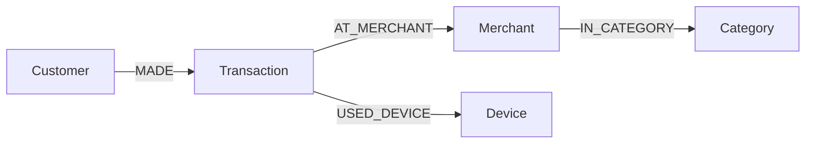
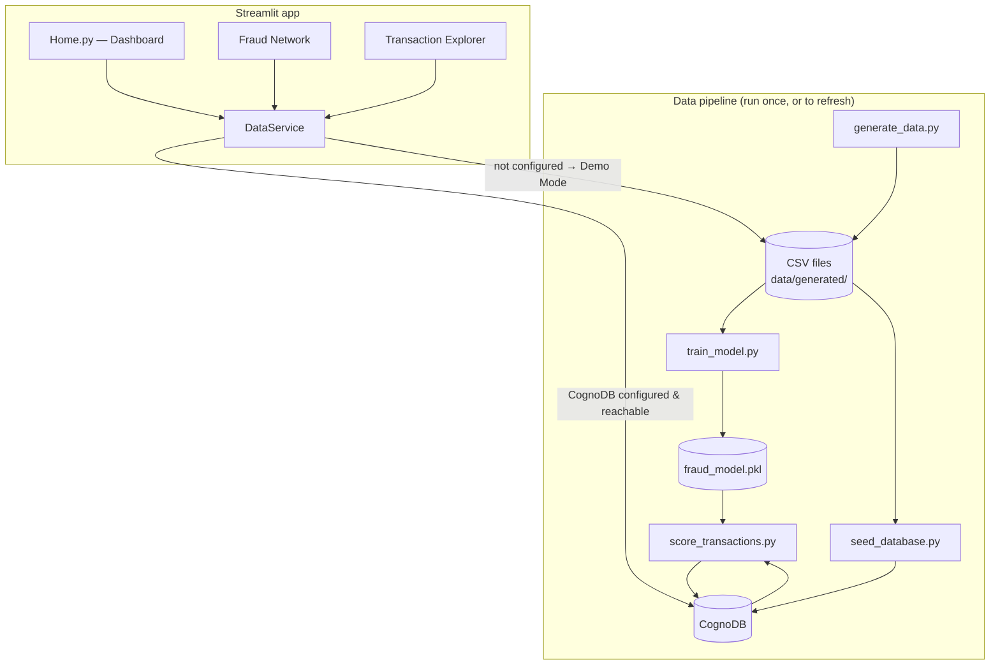

# 🕸️ Fraudlens

**Graph-native fraud analytics.** XGBoost scores each transaction's fraud risk in isolation; CognoDB reveals the relationships — shared devices, compromised merchants, connected customers — that explain *why* a cluster of transactions is risky and who else is caught up in it.

Built for the Wexa AI take-home assignment: a small, complete application backed by a graph database (CognoDB, Neo4j-Bolt-compatible), demonstrating graph data modeling, engineering architecture, and a working end-to-end ML + graph pipeline.

---

## Table of contents

- [The use case](#the-use-case)
- [Why a graph database?](#why-a-graph-database)
- [Data model](#data-model)
- [Architecture](#architecture)
- [The XGBoost model](#the-xgboost-model)
- [Cypher queries](#cypher-queries)
- [Project structure](#project-structure)
- [Setup](#setup)
- [Running the pipeline](#running-the-pipeline)
- [Running the app](#running-the-app)
- [Tests](#tests)
- [Demo walkthrough](#demo-walkthrough)
- [Deployment](#deployment)
- [Security](#security)
- [Screenshots](#screenshots)
- [Known limitations](#known-limitations)
- [Future improvements](#future-improvements)

---

## The use case

Fraudlens is a fraud-investigation tool for a payments business. It combines two complementary signals:

1. **Transaction-level risk**, scored independently by an XGBoost classifier trained on transaction features (amount, timing, merchant history, and one graph-derived feature: how many distinct customers share a device).
2. **Relationship context**, answered by CognoDB: which merchants keep showing up in fraud, which other customers touch a suspicious merchant, and which customers who've never (knowingly) interacted still share a device or fall inside the same fraud ring.

An analyst opens the **Dashboard** to see the overall picture, drills into **Fraud Network** to explore a customer, merchant, or device ring visually, and uses **Transaction Explorer** to inspect any single transaction's score and context. No Cypher knowledge required.

## Why a graph database?

The interesting questions in fraud investigation are not "what does this row look like" — they're **"who else is connected, and how"**:

- *"This customer's card was used fraudulently. What devices did they use, has any other customer used those same devices, and what did those customers buy?"* — that's a 3-to-4-hop walk across Customer → Transaction → Device → Transaction → Customer.
- *"This merchant has an unusual fraud rate. Which other customers have been exposed to it, and are any of *them* connected to other risky merchants through a shared device?"* — same shape, one more hop.

In a relational schema, each additional hop is a new hand-written `JOIN`, and the query most central to this use case — *"find devices used by more than one customer, where at least one of their transactions was fraudulent, then show what else those customers touched"* — needs a self-join with `GROUP BY … HAVING count(DISTINCT customer_id) > 1`, followed by *another* join to expand outward. It's the kind of query that gets slower and uglier every time an investigator asks "and then what?" It also doesn't scale: a 5-hop entity-resolution query becomes five nested joins, each one a fresh index-selection decision for the query planner.

In CognoDB (openCypher over Bolt), relationships are stored as first-class, traversable edges — not computed at query time from foreign keys. A 3-hop traversal is one `MATCH` pattern:

```cypher
MATCH (c:Customer {customer_id: $id})-[:MADE]->(t:Transaction)
      -[:AT_MERCHANT]->(m:Merchant)-[:IN_CATEGORY]->(cat:Category)
```

and the shared-device ring query — the one a relational schema finds genuinely awkward — is a single pattern match with a `WHERE` filter on the aggregated group (see [`shared_device_rings`](#cypher-queries) below), with no join planning cost that grows with hop count. This is exactly the kind of workload (entity resolution, ring detection, "what's connected to what") that graph databases are built for, and it's why payment networks and card issuers use graph databases in production fraud teams rather than bolting recursive CTEs onto a relational warehouse.

## Data model



| Node | Key properties |
|---|---|
| **Customer** | `customer_id` (unique), `name`, `email`, `city`, `signup_date`, `risk_score` (avg. fraud probability, written by scoring) |
| **Merchant** | `merchant_id` (unique), `name`, `city`, `is_compromised` |
| **Category** | `name` (unique) — e.g. Electronics, Travel, Grocery |
| **Device** | `device_id` (unique), `device_type` (mobile / web / pos) |
| **Transaction** | `transaction_id` (unique), `amount`, `timestamp`, `channel`, `is_fraud` (confirmed/ground-truth label), `fraud_probability` (XGBoost output) |

| Relationship | Direction | Meaning |
|---|---|---|
| `MADE` | `(Customer)-[:MADE]->(Transaction)` | Who made the transaction |
| `AT_MERCHANT` | `(Transaction)-[:AT_MERCHANT]->(Merchant)` | Where it happened |
| `IN_CATEGORY` | `(Merchant)-[:IN_CATEGORY]->(Category)` | What kind of merchant |
| `USED_DEVICE` | `(Transaction)-[:USED_DEVICE]->(Device)` | What device made it — the edge that exposes shared-device rings |

Customer/Merchant/Category/Device are reusable entities loaded with `MERGE` on their natural key; Transactions use a deterministic ID (`TXN0000001`, …) with `MERGE`, so the seed script is idempotent — re-running it never duplicates nodes or relationships.

## Architecture



- **`src/fraudlens/`** — the installable package: config, DB layer (`connection.py`, `schema.py`, `queries.py`, `seed.py`), ML (`features.py`, `train.py`, `score.py`), services (`cognodb_service.py`, `demo_service.py`, `data_service.py`), and UI helpers (`theme.py`, `components.py`, `graph_view.py`).
- **`scripts/`** — thin CLI entry points that call into the package: `generate_data.py`, `train_model.py`, `seed_database.py`, `score_transactions.py`.
- **`app/`** — the Streamlit application (`Home.py` + `pages/`).
- Every Streamlit page goes through **`load_data_service()`**, which returns a live `CognoDBService`, a `DemoDataService`, or renders the right banner and returns `None` — pages never crash, they just show a clear state.

## The XGBoost model

**Features** (`fraudlens/ml/features.py`, one source of truth used by both training and scoring):

| Feature | What it captures |
|---|---|
| `amount` | Raw transaction amount |
| `hour_of_day`, `day_of_week`, `is_weekend` | Timing |
| `channel_online` | Online vs. in-store |
| `amount_zscore_for_customer` | How unusual this amount is for *this* customer |
| `is_new_merchant_for_customer` | First-time merchant for this customer |
| `merchant_fraud_rate` | This merchant's historical fraud rate (leave-one-out at training time) |
| `device_shared_customer_count` | **Graph-native feature** — how many distinct customers have used this device |

Training (`fraudlens/ml/train.py`) fits an `XGBClassifier` (250 trees, depth 4, `scale_pos_weight` set from the class imbalance) on an 75/25 stratified split. On the generated 25,000-transaction dataset (2.16% fraud rate):

| Metric | Value |
|---|---|
| ROC AUC | **0.937** |
| Average precision (PR AUC) | 0.824 |
| Precision @ 0.5 | 0.715 |
| Recall @ 0.5 | 0.800 |
| F1 @ 0.5 | 0.755 |

**Scoring** (`fraudlens/ml/score.py`) is the interesting half of the loop: it does *not* reuse the training CSVs. It pulls features straight from CognoDB — per-customer spend stats, merchant fraud rates, first-merchant-visit timestamps, and device-sharing counts — via Cypher aggregations, assembles the same feature columns, runs the model, and writes `fraud_probability` back onto each `Transaction` node with a batched `UNWIND` write. This is the "XGBoost identifies transaction-level risk, CognoDB reveals the relationships behind it" loop in code: the graph feeds the model, and the model's output lives back in the graph.

## Cypher queries

All queries live in `src/fraudlens/db/queries.py`, are fully parameterized (no string-concatenated Cypher — see `tests/test_queries_params.py`), and batch writes use `UNWIND`.

- **`customer_network`** — the multi-hop traversal (3 hops: `Customer → Transaction → Merchant → Category`). Powers the "what is this customer connected to" graph in Fraud Network.
- **`shared_device_rings`** — the relational-awkward query: devices used by more than one customer with at least one fraudulent transaction. A self-join + `GROUP BY … HAVING` in SQL; one pattern match here.
- **`ring_expansion`** — extends a ring one hop further (what *other* devices do ring members use), demonstrating how a graph query grows by adding a clause, not restructuring the whole thing.
- **`merchants_connected_to_fraud`** (Q1 — *"what merchants are connected to fraudulent activity?"*) — aggregates fraud transactions by merchant and counts distinct connected customers.
- **`merchant_connected_customers`** (Q3 — *"what other customers are connected to suspicious merchant activity?"*) — 2-hop `Merchant ← Transaction ← Customer` filtered to fraud/high-risk.
- **`dashboard_stats`**, **`fraud_by_category`**, **`recent_high_risk_transactions`**, **`search_transactions`**, **`transaction_detail`** — supporting queries for the Dashboard and Transaction Explorer.
- **`fetch_*` feature queries** + **`update_fraud_probabilities`** — the scoring pipeline's read/write side.

## Project structure

```
Fraudlens/
├── app/
│   ├── Home.py                     # Dashboard (Streamlit entry point)
│   └── pages/
│       ├── 1_Fraud_Network.py
│       └── 2_Transaction_Explorer.py
├── src/fraudlens/
│   ├── config.py                   # env vars, paths, demo-mode logic
│   ├── data/generator.py           # synthetic dataset generator
│   ├── db/
│   │   ├── connection.py           # Neo4j driver wrapper + error handling
│   │   ├── schema.py               # constraints & indexes
│   │   ├── queries.py              # all Cypher, parameterized
│   │   └── seed.py                 # idempotent MERGE-based batch loader
│   ├── ml/
│   │   ├── features.py             # shared feature engineering
│   │   ├── train.py                # XGBoost training
│   │   └── score.py                # graph-driven scoring
│   ├── services/
│   │   ├── cognodb_service.py      # live data service
│   │   ├── demo_service.py         # local pandas fallback
│   │   └── data_service.py         # factory / fallback logic
│   └── ui/
│       ├── theme.py, components.py, graph_view.py
├── scripts/
│   ├── generate_data.py
│   ├── train_model.py
│   ├── seed_database.py
│   └── score_transactions.py
├── tests/
├── data/generated/                 # generated CSVs (git-ignored)
├── models/                         # trained model + metrics (git-ignored)
├── .env.example
└── .streamlit/config.toml, secrets.toml.example
```

## Setup

### 1. Create your CognoDB Cloud instance

1. Sign up at [console.cognodb.com/signup](https://console.cognodb.com/signup) (free tier, no credit card).
2. Create a free (**c0**) instance and pick a region — provisions in under a minute.
3. Copy the connection URI (`bolt+s://<id>.databases.cognodb.cloud` or similar) and the generated password for user `cognodb`. **The password is shown once** — save it immediately.

### 2. Clone and install

```bash
git clone <your-repo-url> Fraudlens
cd Fraudlens

# Python 3.11 is recommended (XGBoost/pandas wheels are most reliable there)
python3.11 -m venv .venv
.venv\Scripts\activate            # Windows
# source .venv/bin/activate       # macOS/Linux

pip install -r requirements-dev.txt   # includes pytest; use requirements.txt for prod-only
```

### 3. Configure credentials

```bash
cp .env.example .env
```

Edit `.env`:

```
COGNODB_URI=bolt+s://<your-instance>.databases.cognodb.cloud
COGNODB_USER=cognodb
COGNODB_PASSWORD=<your generated password>
```

`.env` is git-ignored — never commit it.

## Running the pipeline

Run these once, in order, from the project root (venv activated):

```bash
python scripts/generate_data.py       # 1. synthetic dataset -> data/generated/*.csv
python scripts/train_model.py         # 2. train XGBoost -> models/fraud_model.pkl
python scripts/seed_database.py       # 3. load the graph into CognoDB (idempotent)
python scripts/score_transactions.py  # 4. score every transaction, write back to CognoDB
```

Each step prints a short summary. Re-running `generate_data.py` with the same seed reproduces the same dataset; re-running `seed_database.py` is safe (MERGE-based) and won't create duplicates.

## Running the app

```bash
streamlit run app/Home.py
```

Open the printed local URL. If `.env` is missing or incomplete, the app shows a **"CognoDB connection is not configured"** banner instead of crashing — see [Security](#security) for the demo-mode fallback.

## Tests

```bash
pytest -q
```

21 tests covering feature engineering, config/demo-mode fallback logic, query parameterization, and the demo data service — none require a live database.

## Demo walkthrough

1. **Dashboard** — headline numbers: 25,000 transactions, confirmed fraud count/rate/amount, and the XGBoost risk summary (avg. predicted risk, high-risk count).
2. **Fraud Network → Customer network** — pick a customer (ranked by flagged transactions) and see the live `Customer → Transaction → Merchant → Category` graph.
3. **Fraud Network → Merchants connected to fraud** — identify a merchant with many fraud transactions, then see which other customers are connected to it.
4. **Fraud Network → Shared-device rings** — the relational-awkward query rendered as a graph: one device, several customers, expandable one hop further.
5. **Transaction Explorer** — search/filter, inspect a transaction's amount, merchant, customer, XGBoost risk, and fraud status, plus related activity (other customers on the same device).
6. Closing line, shown on every transaction detail: *"XGBoost identifies transaction-level risk, while CognoDB reveals the relationships behind that risk."*

## Deployment

Deployed on **Streamlit Community Cloud** (free tier):

1. Push this repo to GitHub (public, or private + grant access).
2. Go to [share.streamlit.io](https://share.streamlit.io), sign in with GitHub, click **New app**.
3. Pick the repo/branch, set **Main file path** to `app/Home.py`.
4. Under **Advanced settings → Secrets**, paste the contents of `.streamlit/secrets.toml.example` with your real `COGNODB_PASSWORD` filled in.
5. Deploy. `runtime.txt` pins Python 3.11; `requirements.txt` installs the app itself (`-e .`) plus all dependencies.

`app/Home.py` calls `sync_streamlit_secrets_to_env()` before anything else, copying Streamlit secrets into `os.environ` so the same `config.py` code path works identically locally (`.env`) and deployed (`st.secrets`).

**Live demo:** _add your deployed URL here after deploying._
**Screen recording:** _add your recording link here._

## Security

- Never committed: `.env`, `.streamlit/secrets.toml`, any CognoDB password or API key. Both are git-ignored; `.env.example` and `.streamlit/secrets.toml.example` are the committed templates.
- Locally, credentials are read from `.env` via `python-dotenv`. On Streamlit Cloud, they're read from **Secrets** and bridged into `os.environ` at startup.
- **Fallback, not fakery:** if CognoDB isn't configured, the app shows *"CognoDB connection is not configured"* and, for local UI development only, can optionally fall back to a local synthetic dataset (`FRAUDLENS_DEMO_MODE=true`, or automatically when credentials are absent). Every page in that mode shows a persistent "Demo Mode" banner — it never pretends to be running live Cypher queries. If CognoDB *is* configured but unreachable, the app shows the real connection error instead of silently substituting demo data.

## Screenshots

_Add screenshots of the Dashboard, Fraud Network (customer graph + shared-device ring), and Transaction Explorer here before submitting — e.g._

```
docs/screenshots/01-dashboard.png
docs/screenshots/02-fraud-network-customer.png
docs/screenshots/03-fraud-network-rings.png
docs/screenshots/04-transaction-explorer.png
```

## Known limitations

- Fraud rings and compromised merchants are synthetically injected for the demo dataset; a production system would derive `is_fraud` from confirmed chargebacks, not generation logic.
- `merchant_fraud_rate` at scoring time is a simple average (not leave-one-out like at training time) — a small, acceptable bias for an MVP.
- The graph visualizations (pyvis) render client-side JS in an iframe; very large customer histories (hundreds of transactions) are capped at 150 rows for readability.
- No authentication on the Streamlit app — anyone with the URL can view the dashboard (acceptable for a take-home demo, not for production).

## Future improvements

- Move `merchant_fraud_rate` and similar aggregates into CognoDB as scheduled `SET`-based updates instead of recomputing at scoring time.
- Add a feedback loop: let an analyst mark a transaction as confirmed fraud from the UI, writing back to `is_fraud` and retraining periodically.
- Expand the graph with `IP_ADDRESS` and `BILLING_ADDRESS` nodes for additional entity-resolution signals beyond shared devices.
- Add authentication and role-based access before any real deployment.
